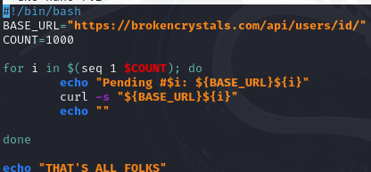
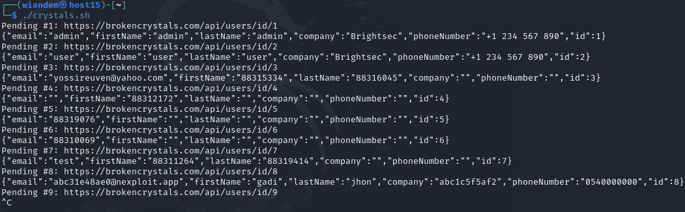

# Нарушение контроля доступа
## Цель работы
    Определить возможность получения несанкционированного доступа к данным или функциям системы путем изменения параметров запроса или прямого обращения к защищенным ресурсам
### Выполнение
открыл сайт https::/brokencrystals.com

зашел под логином паролем

в burpsuite перехватил следующие API запросы:

    GET api/users/id/70 - возвращает данные пользователя, соответствующего номеру, в JSON формате
    GET /api/users/one/user1/adminpermission - проверяет наличие у пользователя прав администратора

из запросов было выявлено, что:

- идентификатор пользователя передается в URL
- в URL передается имя пользователя

## АТАКА
была проведена работа с запросом

GET /api/users/id/2576 - возвращает данные пользователя, соответствующего идентификатору

В Burp Suite идентификатор был изменён на:

GET /api/users/id/200

Сервер ответил кодом:

HTTP/2 200 OK

Таким образом подтверждено, что сервер не проверяет принадлежность запрашиваемого объекта текущему пользователю. Любой авторизованный пользователь может получать данные других пользователей путём изменения числового идентификатора в URL.

## Эксплуатация уязвимости

после подтверждения уязвимости был создан исполняемый файл, написанный на языке bash, в котором фигурировал цикл с командой curl и перебор адресов с различными идентификаторами

Таким образом был получен доступ к персональным данным пользователей системы. Это подтверждает наличие горизонтальной эскалации привилегий.

## Выводы

в ходе тестирования была выявлена уязвимость класса Broken Access Control, что соответствует категории A01:2021 проекта OWASP Top 10. Приложение не проверяет принадлежность объекта текущему пользователю при обращении к ресурсу вида

GET /api/users/id/{id}

Отсутствие серверной проверки приводит к горизонтальной эскалации привилегий, при которой любой авторизованный пользователь может получить доступ к персональным данным других пользователей системы. Таким образом нарушается принцип минимальных привилегий и базовые требования к разграничению доступа. Эксплуатация уязвимости не требует специальных технических навыков и может быть автоматизирована посредством перебора идентификаторов. Это создаёт риск массового раскрытия персональных данных, получения информации об администраторах системы и подготовки целевых атак.

Подобные нарушения регулярно регистрируются в реальных информационных системах. Примером являются CVE-2023-27524 и CVE-2022-31813, в которых также отсутствовала корректная проверка прав доступа при обращении к объектам через API. Данный тип уязвимости относится к категории CWE-639 Authorization Bypass Through User-Controlled Key.

Для устранения проблемы необходимо использовать доступ с минимальными привилегиями, внедрить многофакторную аутентификацию (MFA) для конфиденциальных операций и регулярно проверять разрешения пользователей

