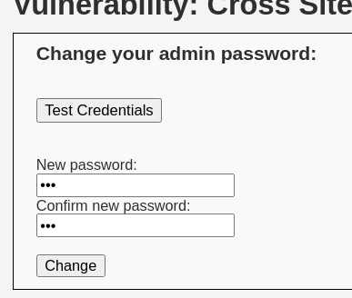
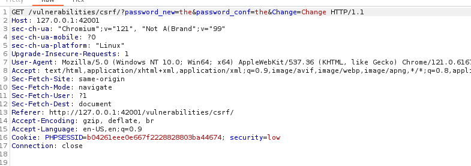
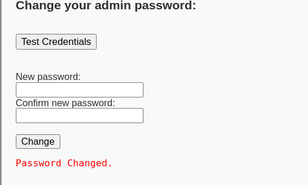

# Подделка запросов (CSRF)

### Цель работы

Выявить возможность выполнения несанкционированных действий от имени авторизованного пользователя без его ведома, 
проанализировать наличие защитных механизмов против CSRF-атак и оценить риск компрометации учетной записи.

## Ход выполнения

### 1) Разведка

Для анализа был выбран модуль CSRF в DVWA. При попытке смены пароля был перехвачен запрос:

Анализ перехваченного запроса показал, что смена пароля выполняется через GET-запрос с параметрами в URL:

`GET /vulnerabilities/csrf/?password_new=the&password_conf=the&Change=Change HTTP/1.1`

### 2) Атака

Для проверки уязвимости была изменена прямая ссылка для смены пароля на произвольное значение:

`http://127.0.0.1:42001/vulnerabilities/csrf/?password_new=the&password_conf=the&Change=Change#`

### 3) Эксплуатация

При переходе по сформированной ссылке в браузере пароль был успешно изменен на `the`, о чем свидетельствует сообщение системы:

Это подтверждает, что для выполнения смены пароля достаточно заставить жертву перейти по подготовленной ссылке.

## Выводы о защищенности

В результате анализа выявлено отсутствие защиты от CSRF-атак: смена пароля выполняется через GET-запрос без CSRF-токенов
и без подтверждения. Это позволяет злоумышленнику изменить пароль жертвы, отправив ей специально сформированную ссылку.

Данная атака классифицируется как:
- **CWE-352: Cross-Site Request Forgery (CSRF)** - подделка межсайтовых запросов
