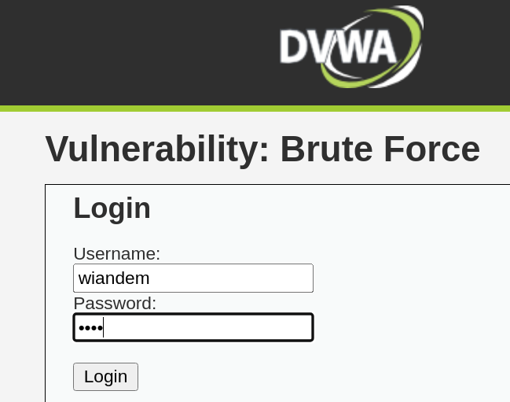
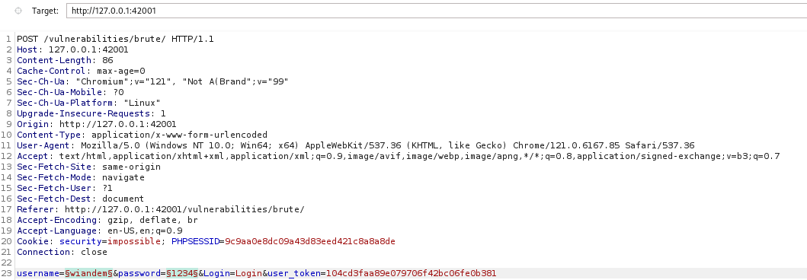
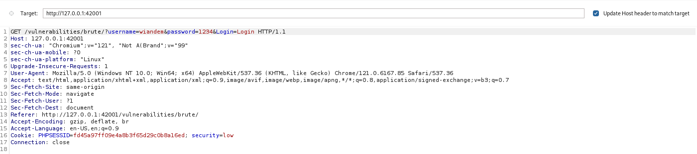
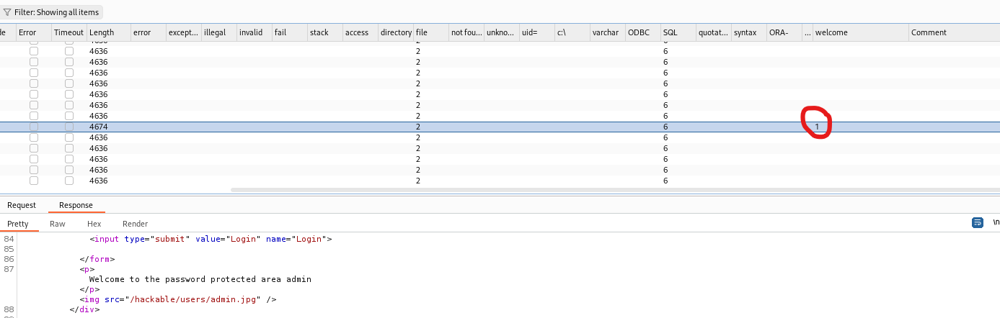

# Брутфорс
## Цель работы
Выявить возможность подбора учетных данных пользователя методом перебора, проанализировать наличие защитных механизмов против автоматизированных атак и оценить устойчивость приложения к брутфорс-атакам.
## Ход выполнения
Для анализа был выбран раздел Bruteforce в DVWA. 

После попытки входа с произвольными данными, в Burpsuite был перехвачен GET - запрос  с введенной информацией

для проведения атаки был использован модуль Intruder, в который был отправлен GET - запрос и выбран тип атаки Cluster Bomb, данные логина и пароля выбирались из созданных словарей, а также был задан фильтр ответа DVWA на успешный подбор комбинации - фразу "Welcome to the password protected area"

После запуска атаки Intruder выполнил запросы с перебором комбинаций, в результате только один запрос содержал фразу, свидетельствующую об успешности.

Верная комбинация составила admin/password. Это подтверждает, что приложение не защищено от автоматизированного перебора учетных данных.

## Выводы о защищенности

В результате анализа выявлено отсутствие механизмов защиты от брутфорс-атак. Это позволяет злоумышленнику подобрать пароль к любой учетной записи.

Данная атака классифицируется как:

CWE-307: Improper Restriction of Excessive Authentication Attempts — отсутствие ограничений на количество попыток аутентификации
CWE-521: Weak Password Requirements — использование слабых паролей, поддающихся перебору
