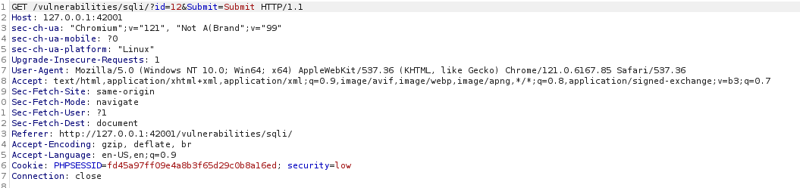
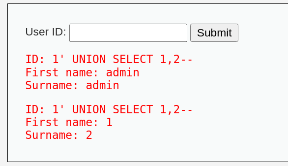
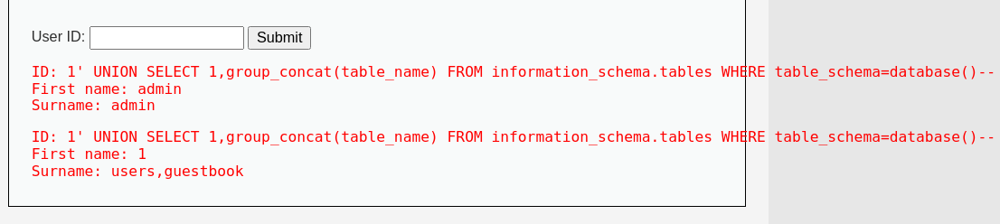
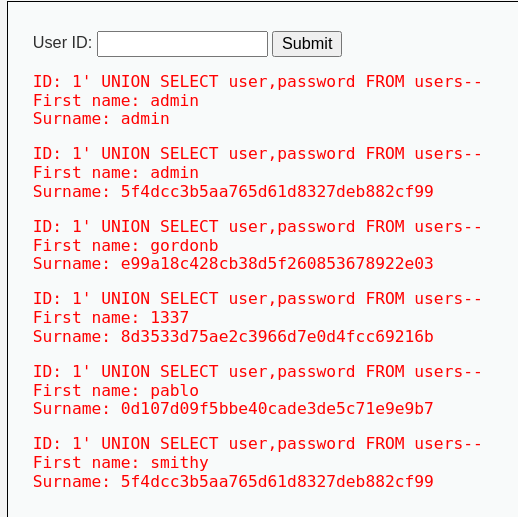
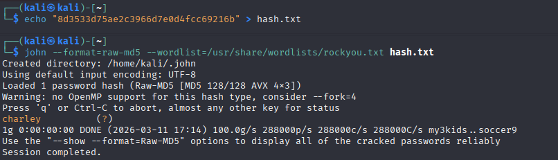

# SQL - инъекции (внедрение кода)

## Цель работы

Выявить наличие уязвимости внедрения кода в веб - приложение, проанализировать возможность исполнения  несанкционированных запросов к базе данных и исполнения произваольного кода на стороне сервера.

# Ход выполнения

Для анализа был выбран модуль "SQL Injection" в DVWA. Был перехвачен типичный GET-запрос при вводе ID=1:

Из запроса можно увидеть что модуль принимает ID и возвращает информацию по этому идентификатору из базы данных.

Был введен запрос 1' UNION SELECT 1,2-- для большего понимания отображения столбцов на странице, в результате цифры 1 и 2 отобразились на странице, значит оба аргумента можно использовать для вывода нужных нам данных.

Для получения списка всех таблиц использован запрос с обращением к системной таблице information_schema

    1' UNION SELECT 1,group_concat(table_name) FROM information_schema.tables WHERE table_schema=database()-- 

В результате имеем названия столбцов: user_id, first_name, last_name, user, password, avatar, last_login, failed_login. интереснее всего здесь столбцы user и password.

Теперь, когда известны все столбцы, хранящиеся в БД, можем выполнить финальный запрос для вывода данных:

    1' UNION SELECT user,password FROM users-- 

Нам предстают захешированные пароли в паре с привязнаными к ним логинами. Можно попытаться расшифровать один из них, например хеш для логина 1337 - 8d3533d75ae2c3966d7e0d4fcc69216b:

В результате видим, что хеш пароля соответствует хешу слова charley.

Пробуем эти данные на странице логина, и видим успешный вход.

## Заключение

В результате анализа выявлена SQL-инъекция, позволяющая несанкционированно извлекать данные из базы. Отсутствие фильтрации входных данных в параметре id дает возможность модифицировать структуру SQL-запроса, что привело к получению учетных данных всех пользователей и успешный вход в систему. Эта возможность подтверждает критичность уязвимости.

Данная атака классифицируется как:

**CWE-89: Improper Neutralization of Special Elements used in an SQL Command - SQL-Injection**
